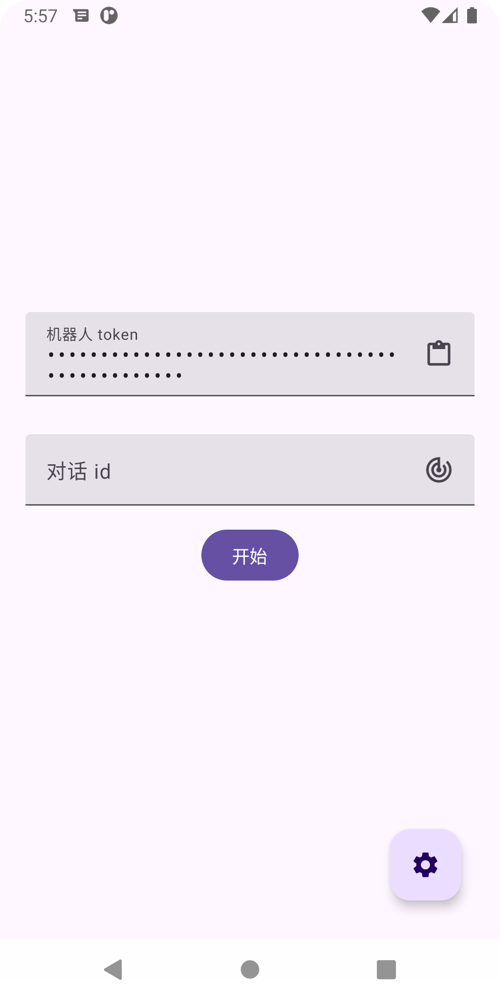
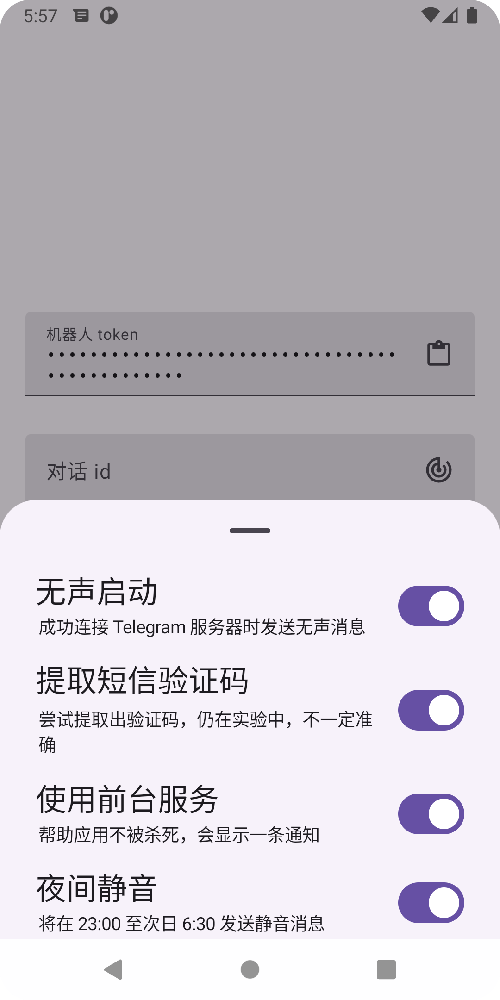
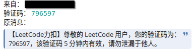

# Simple Message Forwarder
# [English Version](./README.MD)

Simple Message Forwarder 是一个将短信转发到 Telegram 的小型软件。


## 截图




## 使用方法
- 填入 `Bot Token`
- 填入 `Chat Id` (亦可点击右边按钮，向您的机器人发送任何消息，该信息可以被自动填入)
- 点击 `开始` 按钮，服务将会给您发送一个消息，并在后台运行

## 命令
- `/getinfo` 获取当前手机电量
- `/getLastMessage <1..5>` 获取最后 1~5 条消息

## 开发
把你的密钥放在 `./app` 文件夹下，并命名为 `key.jks`，然后填写 `local.properties`
```
keyStorePassword=yourpassword
keyAlias=yourkeyalias
keyPassword=yourkeypassword
```
或者可以使用环境变量，详见 `build.gradle.kts`.\
最后
`./gradlew :app:assembleRelease`

## 消息实例
```Markdown
来自： ${Sender}
验证码：`${VerificationCode?}`
原消息：
>${MessageBody}
```

## 在部分设备上的注意事项
- 小米：关闭系统`信息`应用的验证码保护，并手动授予读取通知类短信的权限。